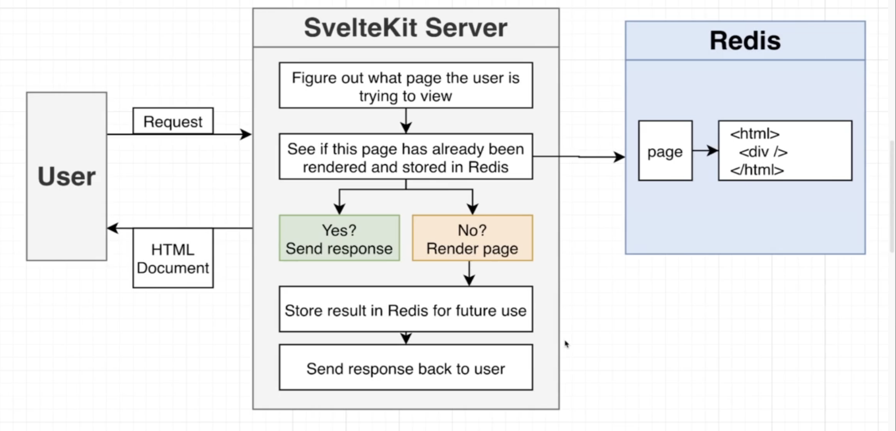
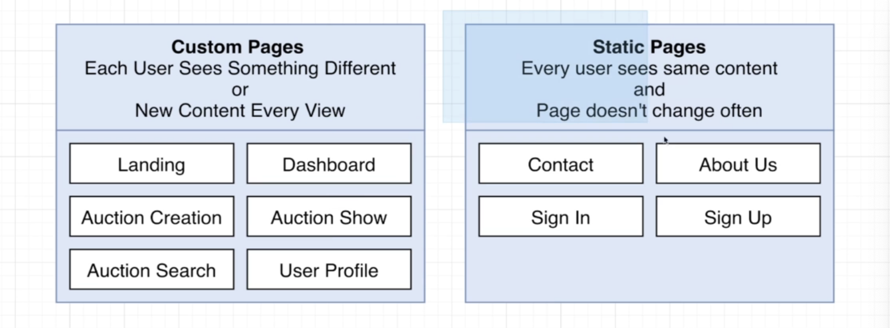
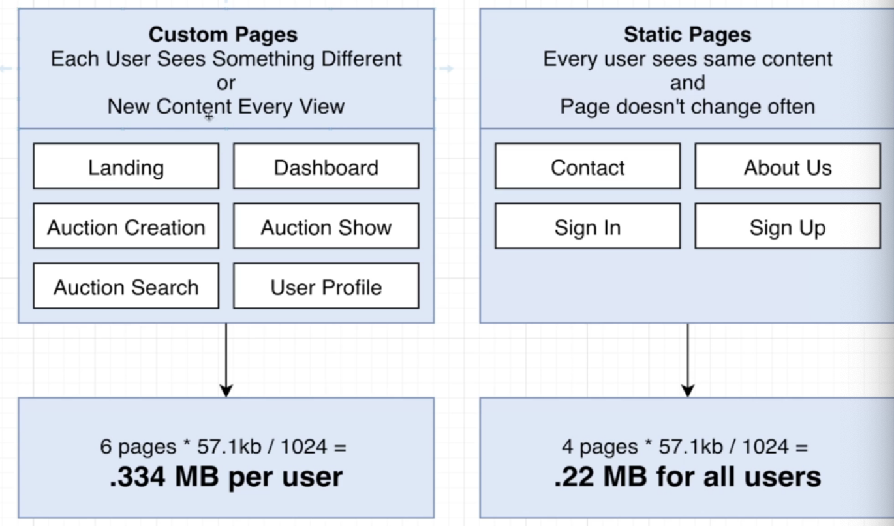
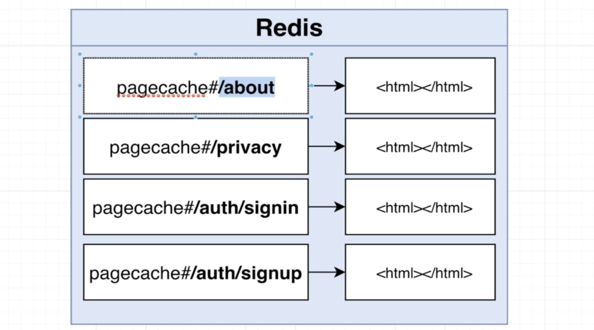

# REDIS DESIGN PATTERNS

This project is an eBay-like application that uses Redis as its sole cache storage. It should be noted that this project is not intended for production use, as Redis is a volatile memory and therefore does not provide durability.

The project was developed as part of the [Redis: The Complete Developer's Guide course](https://www.udemy.com/course/redis-the-complete-developers-guide-p/) on Udemy, taught by Stephen Grider.

## DESIGN METHODOLOGIES

#### SQL DATABASE DESIGN METHODOLOGY

1. Put the data in tables.
2. Figure out how we will query it.

#### REDIS DESIGN METHODOLOGY

1. Figure out what queries we need to answer.
2. Structure data to best answer those queries.

## EXAMPLE OF  CLIENT PAGE CACHED

What is described below is implemented in './src/services/queries/page-cache.ts'.

It is smart to cache only the static page that every user sees same content, instead of custom pages that change based on the user that is requesting them:

For instance the Homepage in our app is 57.1kb, and we can start seeing on average how much should we store if we select one option, as we can see, **it is not feasible for the custom pages** to be cached.

**DESIGN CONSIDERATIONS:**

- What type of data are we storing? Strings.

- Should we be concerned about the size of the data? Yes, only cache static pages.

- Do we need to expire this data? Yes, expire after some number of minutes/ hours.

- What will the key naming policy be for this data?

  - Key should be unique

  - Other engineers should understand what a key is for. Tip - use functions to generate your key names so you never make a typo. Extremely common pratcice is to use a ':' to separate different parts of the key, e.g. users:45, items:19, user:posts:901. We are going to use a '#' before unique ID's to make implementing search easier, e.g. user#45, user:posts#901 (it is a new feature on redis for searching elements in cache easier).

    

- Any business-logic concerns? No.

## HOW TO INSTALL IT

1. Node js Setup
2. At the terminal run 'npm install' inside the project directory
3. Add connection info about redis into '.env' file.
4. Start the project up by running 'npm run dev'.

